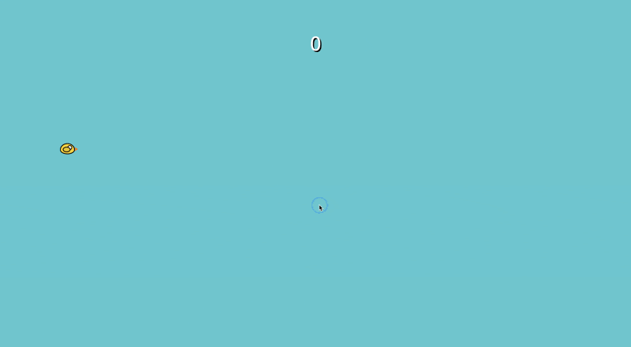

# 🐦 Full Screen Flappy Bird

A modern, full-screen Flappy Bird clone built with **pure HTML, CSS, and JavaScript**. Designed to run smoothly on desktop and mobile with responsive layout, touch controls, keyboard input, and dynamic difficulty scaling — no frameworks required.

<p align="center">
  <a href="https://stephen-costa20.github.io/flappy-bird/">
    
  </a>
</p>

<p align="center">
  ▶️ <strong><a href="https://stephen-costa20.github.io/flappy-bird/">Play Live Demo</a></strong>
</p>

---

## 🎮 Features

- Full-screen, responsive gameplay
- Smooth gravity-based physics and animations
- Keyboard, mouse, and touch controls
- Dynamic pipe generation with increasing difficulty
- Score tracking with visual feedback
- Game-over overlay with instant restart
- Fully self-contained — single HTML file

---

## 🕹 Controls

| Action | Input |
|------|------|
| Jump / Flap | Spacebar, ↑ Arrow, Mouse Click, Touch |
| Restart | Click **Play Again** button |

---

## 🚀 Getting Started

### Option 1: Play Online
Simply click the link below — no setup required:

👉 **https://stephen-costa20.github.io/flappy-bird/**

### Option 2: Run Locally
1. Clone the repository:
   ```bash
   git clone https://github.com/stephen-costa20/flappy-bird.git
   ```
2. Open the file:
   ```bash
   open flappy_bird.html
   ```
   Or just double-click the HTML file in your browser.

---

## 🧠 How It Works

- The bird uses velocity + gravity physics for natural movement
- Pipes are generated dynamically with randomized gaps
- Collision detection is handled via bounding boxes
- Difficulty subtly increases as your score grows
- Designed to adapt seamlessly to different screen sizes

---

## 🛠 Tech Stack

- **HTML5**
- **CSS3**
- **Vanilla JavaScript**

No libraries. No frameworks. No build tools.

---

## 📁 Project Structure

```text
/
├── flappy_bird.html
├── assets/
│   └── screenshot.gif
└── README.md
```

---

## 📸 Screenshots

Gameplay preview:


---

## 🌱 Ideas for Future Enhancements

- Sound effects and background music
- High score persistence (localStorage)
- Difficulty modes
- Mobile vibration feedback
- Visual themes / skins

---

## 📄 License

MIT License — free to use, modify, and share.

---

## 👤 Author

**Stephen Costa**  
GitHub: https://github.com/stephen-costa20

---

⭐ If you enjoyed this project, consider starring the repo!
